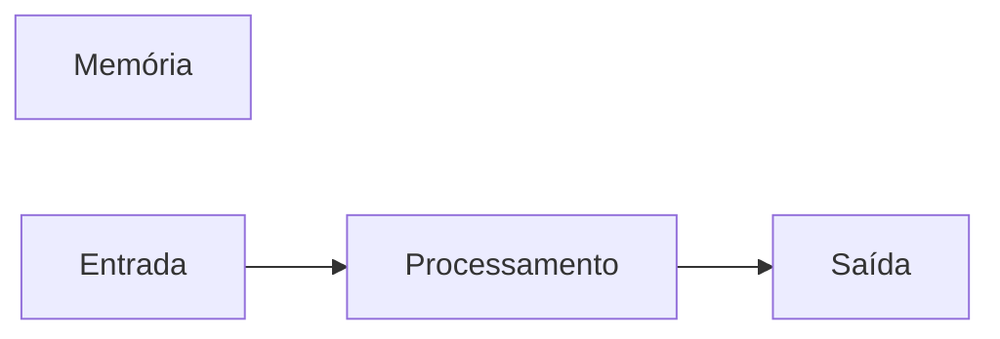

# Javascript-joseAssis
Repositório usado para estudo  da lógica de programação com JavaScript

## Autor
Juan Rozas

---

## Variáveis
Variáveis são espaços na memória do computador usado para guardar valores que podem alterar ao longo do programa.
### Principais tipos primitivos:
- strings ( Texto )
- number ( números inteiros e não inteiros )
- boolean ( Verdadeiro ou falso )

